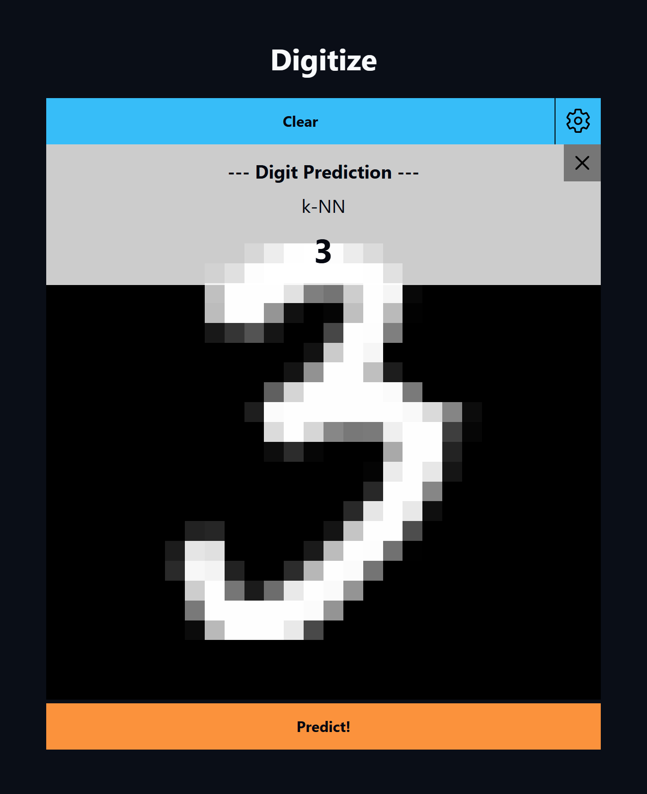
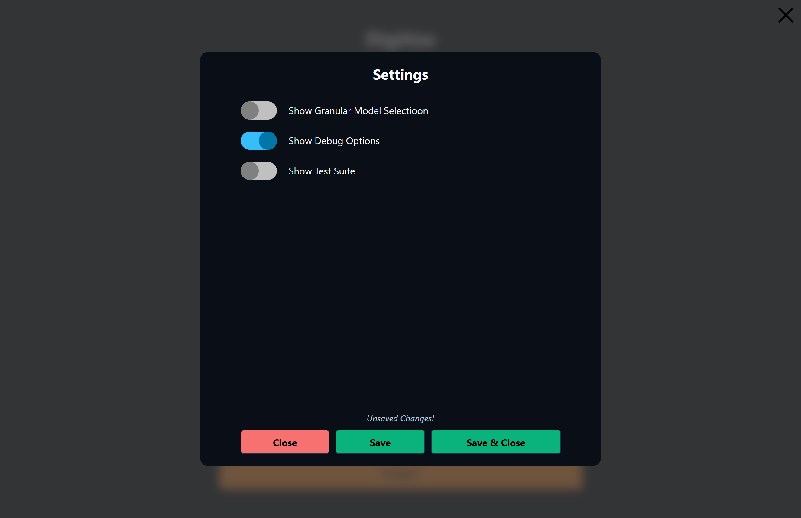

# Digitize

Digitize is a web app that uses the MNIST dataset to recognise handwritten digits.

## Features:
- Interactive canvas: draw, clear, and test user-defined inputs with the digit prediction algorithms
- Two prediction algorithms:
    - Nearest Centroid - compares input to the centroids (i.e. average pixel value representations) of each digit from the training set
    - k-Nearest Neighbours - finds k closest images in the training set and selects the most commonly predicted digit
- Benchmarking suite: for testing algorithm accuracy -> results print to browser developer console
- Settings menu: settings to toggle visibility of menus to create a cleaner UI

## How to run:

### Option 1 - [Use live demo](https://eric-skaftason.github.io/digitize/)

### Option 2 - Run Locally
1. Ensure Node.js & npm are installed
2. Run `npm install` to install required packages
3. Open a command terminal in the root directory of the project
4. Run `npx serve .`
5. Open the localhost link printed to the CLI

### To recompute model data
1. Open a command terminal in the root directory of the project
2. Install dependencies -> `npm install`
3. Compute model data -> `npm run init-models`
4. Start local server -> `npx serve .`
5. Open the localhost link printed to the CLI

## How to use:

### Classify a handwritten digit:
1. Draw a digit on the canvas
2. Click "Predict"
3. Click "Clear" to continue

### Accessing additional functions:
1. Click the cog "⚙" to open the settings menu
2. Enable any additional menus for extra functionality
3. Save settings and close menu 

### Menu: Granular Model Selection
Allows slection of a specific algorithm for digit classification.  Click on the desired button to predict using the corresponding algorithm.  The menu also includes a function to draw a random digit on the canvas.

### Menu: Debug Options
Debug functions.

### Menu: Test Suite
Provides functions to test the accuracy of the predicition algorithms using the MNIST test set.  All results print in the console.  Some tests may take a while; the page can become unresponsive during this time.

## Screenshots & Demos:

### Main app

### Settings menu

### Video demo
<video src="assets/demo/working_demo.mp4" width="1000px" controls></video>